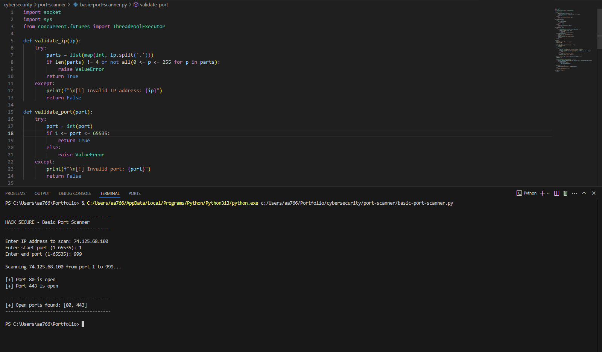

# 🔐 Basic Port Scanner (Python)

This is a basic TCP port scanner built using Python’s `socket` module. It scans for open ports on a target host within a specified range (1–1024).

---

## 🛠️ Features

- Accepts hostname or IP address as input
- Scans first 1024 ports for open services
- Displays open ports with minimal delay
- Built-in error handling for unknown hosts and network issues

---

## 🚀 How to Run

python port_scanner.py

## 📸 Screenshots

