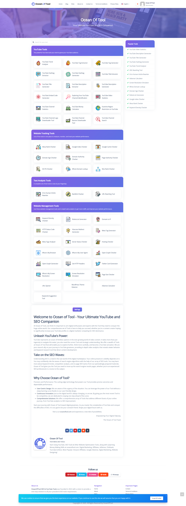
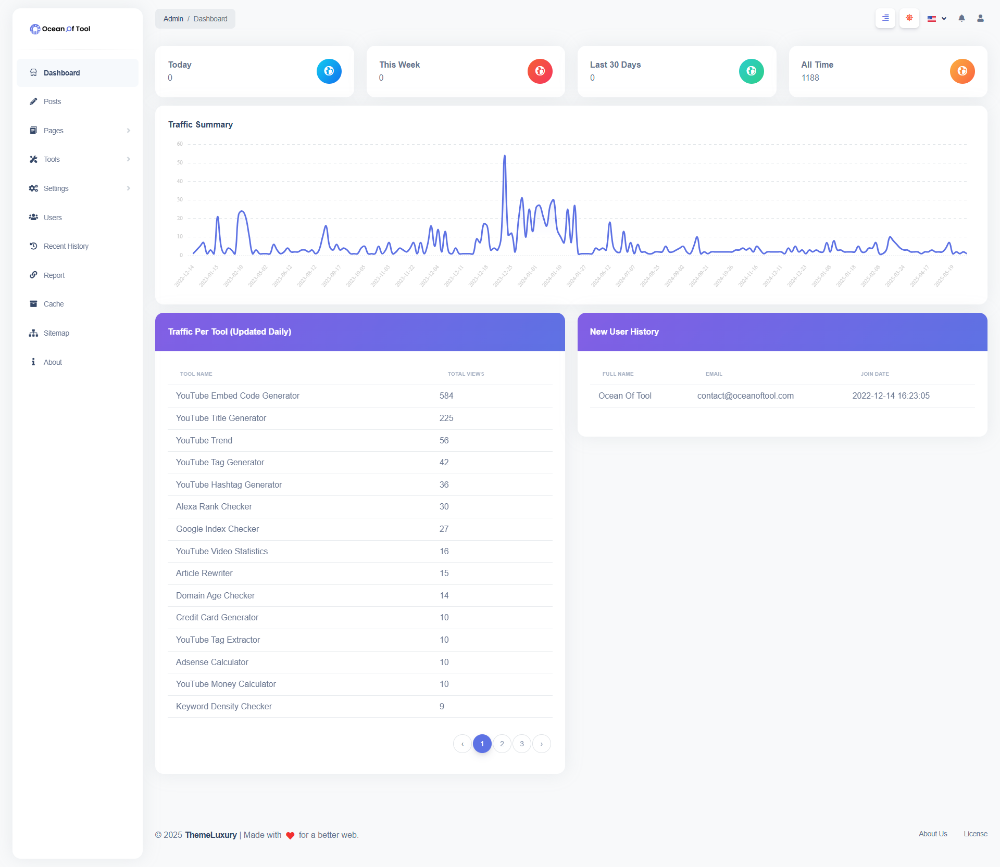
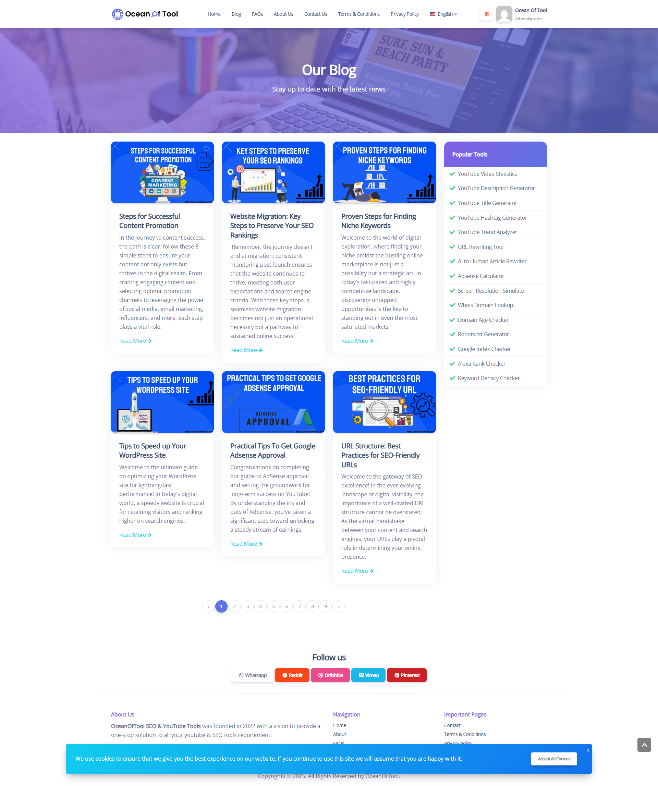
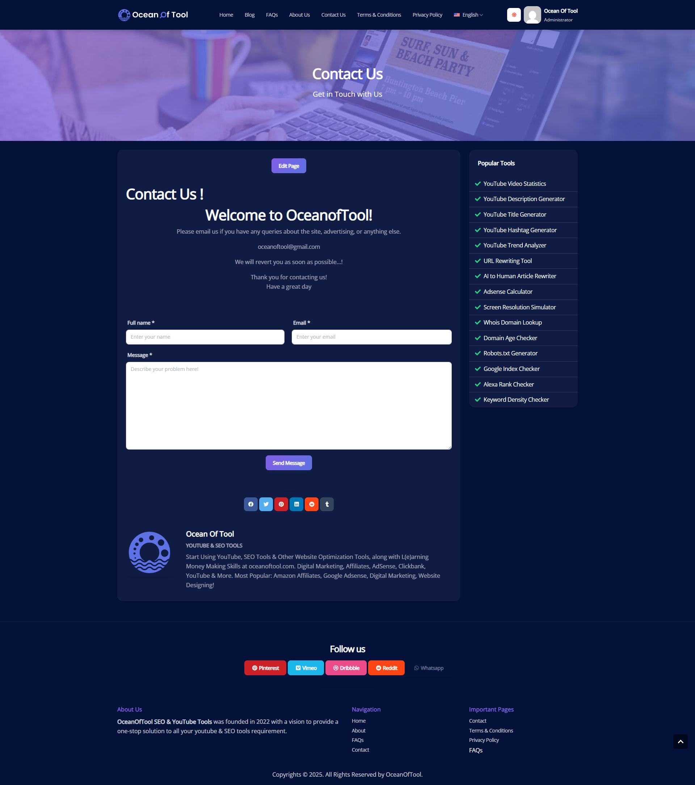

# Ocean of Tool – Blog + On-Page SEO Tools Platform

**🧩 Built With:** Prebuilt PHP Script, Custom Modifications  
**📌 Features:** Blog + on-page SEO tools (keyword research, trend analysis, meta tools), client-specific customizations, login system, dashboard, mobile-friendly design  
**🎯 Role:** Setup and customization of prebuilt PHP script, UI edits, feature modifications as per client needs, tool configuration, and SEO optimization

---

## 📸 Pages & Screenshots

### 🔐 Login Page

### 🏠 Home Page

### 📊 Dashboard

### 📝 Blog Page

### 🛠️ Contact Page

---
